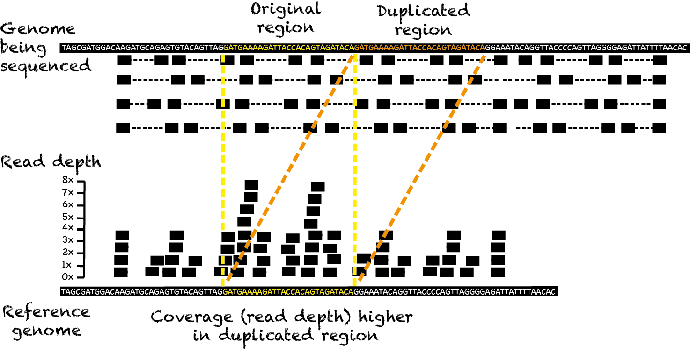
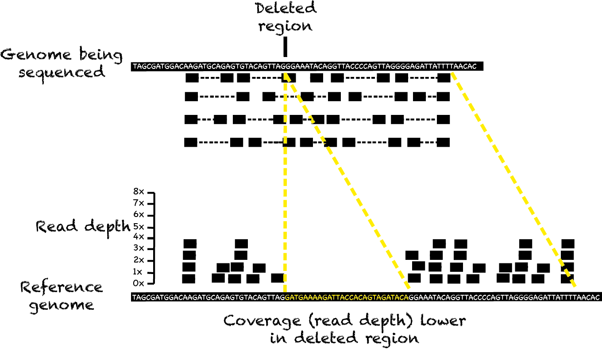
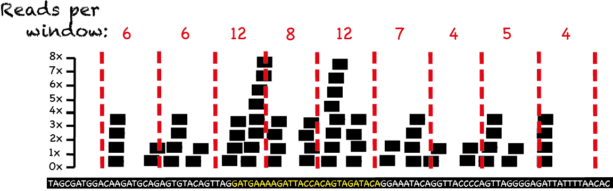
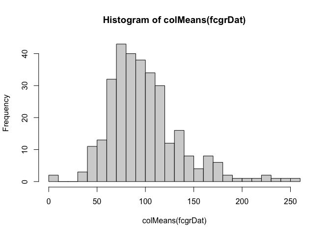
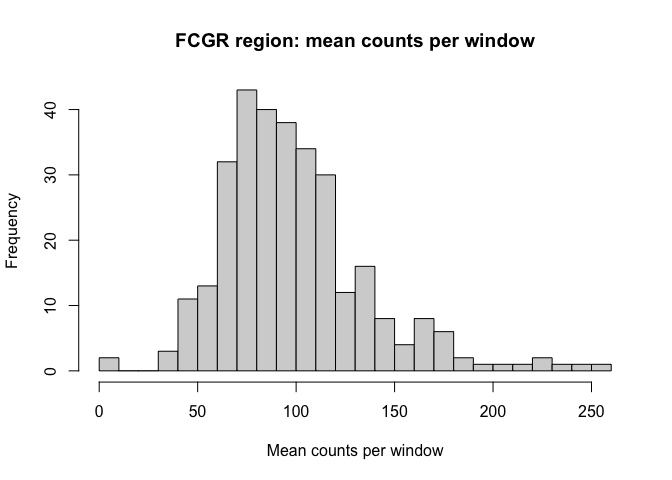
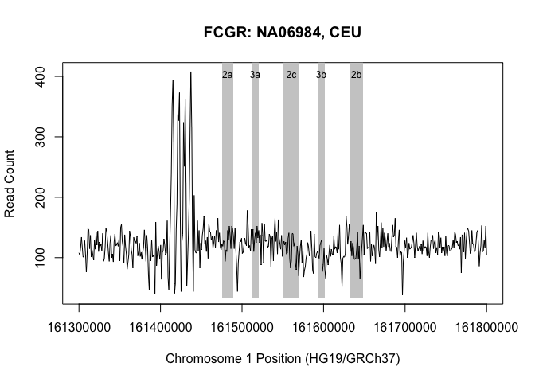
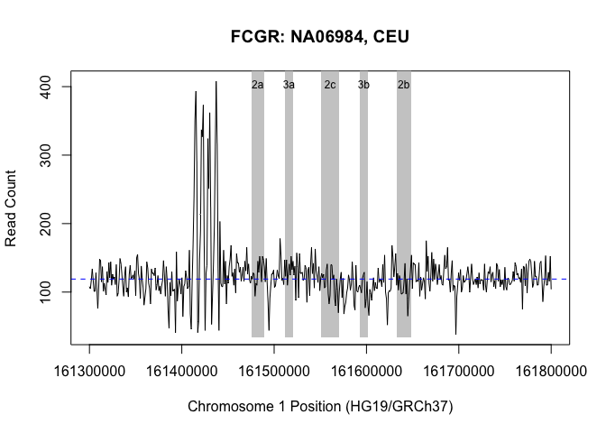
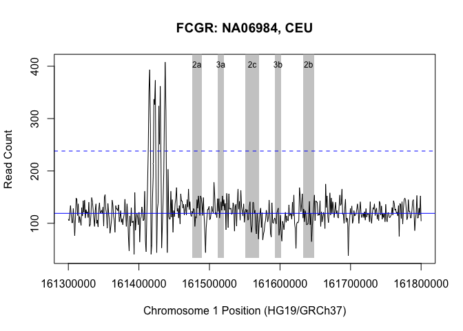
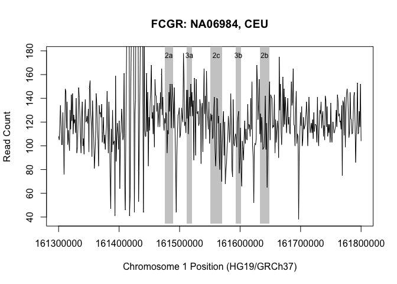
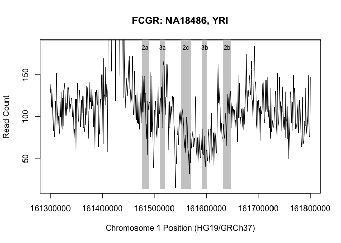

GENE315 CNV lab - week 1
================
Mik Black & Phil Wilcox
29 & 30 March 2023

<!-- The following will produce markdown output that will be viewble on GitHub: -->
<!-- rmarkdown::render('GENE315-CNV_lab-week1.Rmd', output_format="github_document") -->
<!-- Use the following to create a file of R commands for the demonstrators (included in .gitignore): -->
<!-- knitr::purl('GENE315-CNV_lab-week1.Rmd') -->
<!-- NB: check to see if I commented stuff out below in 2020 due -->
<!--     to the COVID-19 changes (search for "C19") -->
<!-- NB: change due dates at end of document -->

## Background: copy number variation

Deviation from the diploid copy number in genomic segments (\>50 bp) is
known as copy number variation (CNV). Copy number variants often
encompass genes and are an important but poorly understood source of
variation in genomes. In humans copy number variation has been
associated with phenotypes such as autoimmune disease and weight. IRGM
is a relatively simple 20kb insertion-deletion upstream of the
immunity-related GTPase family M gene and is associated with Crohn’s
disease (Prescott et al. 2010). FCGR3B (Fc gamma receptor 3B) is within
a more complex locus (refer lectures) with copy number typically varying
from 0 to 4 within a population (McKinney and Merriman, 2012). It is
associated with autoimmune diseases such as rheumatoid arthritis and
systemic lupus erythematosus.

<!-- AMY1 (amylase1) is the most complex locus, with copy number varying from 2 to >15 within a given population. Between populations it correlates with ancestral diet – the higher the starch, the higher the copy number (Perry et al. 2007). -->

## Generation of copy number calls from 1000 Genomes data

High-throughput DNA sequencing technologies provide the ability to
examine copy number variation on a whole genome scale. When a sample is
sequenced it is assigned an average coverage level, which reflects the
number of bases sequenced relative to the size of the genome. For
example, if 300 million 100bp reads are generated for a 3Gbp genome the
average coverage will be 10x (number of reads x read length / genome
size = 300,000,000 x 100 / 3,000,000). Analysis approaches based on read
depth use this idea to identify regions that exhibit large deviations
away from the expected level of coverage to identify changes in copy
number. For example, a region exhibiting 30x coverage in a diploid
genome that has been sequenced to a depth of 20x could reflect a gain of
one additional copy of that region of DNA.

In order to generate copy number calls based on read depth, aligned
sequence data are required. The 1000 Genomes Project provides such data
for the genomes of thousands of individuals from populations around the
world. In this part of the lab we will use data from the 1000 Genomes
Project to investigate variation in gene copy number at the FCGR3B and
IRGM <!-- ,  and AMY1  --> loci.

Aligned DNA sequence read data will be provided for a subset of the 1000
Genomes sample data for 1Mbp regions around the two <!-- three --> loci
of interest. At each locus you will use the R software to perform:

- Generation of read depth information
- Visualisation of read depth across the region of interest
- Segmentation analysis to identify regions of altered copy number

Below is an example of the R code required to perform an analysis of CNV
at the FCGR locus - we will work through this code in the lab. You will
then need to alter the provided code to perform a similar analysis for
IRGM so you can answer the questions on the final page of this document.

## Overview: 1000 Genomes Project

In this lab you will be looking at copy number variation in samples from
the 1000 Genomes Project, using publicly available high-throughput
sequencing data. The link for the 1000 Genomes Project is:

<http://www.internationalgenome.org/>

The first couple of questions for your assignment relate to the 1000
Genomes Project - you should be able to find the answers to those
questions by having a look around their website.

Aligned sequence data from the 1000 Genomes Project was obtained from
their ftp download site. For this lab we are using a relatively small
subset of the full data (310 samples) out of 2535, from three of the 26
populations included in the study.

As mentioned in class, the aligned data for each sample is stored in the
BAM format on the ftp server. One of the nice things about BAM is that
you can *index* the data files, which makes it possible to retrieve a
subset of the data (e.g., from a particular region of the genome)
without having to download the entire data file.

This is an important point, as the data files for a single sample are
fairly large (e.g., around 30GB). For this lab I have downloaded data
from regions around the two <!-- three  --> genes of interest (FCGR3B
and IRGM). For each of these regions, the data extracted was only
between 3MB & 20MB, making it relatively quick and (somewhat) easy to
retrieve data for large numbers of samples.

## Recap: read depth and copy number

In class we talked about read depth (number of times a base of DNA was
read by the sequencer) could be used to investigate changes in copy
number. The plot below shows an example of a duplication, with a
corresponding increase in read depth across the duplicated region:



The opposite occurs with deletions - decreased read depth across the
deleted region, as shown in the following plot:



For low coverage samples (i.e., samples for which the average read depth
is relatively low, e.g., less than 10x) simply calculating read depth at
every base can make for very noisy data. An alternative is to split the
region of interest into fixed-width *windows* (e.g., 500 or 1000bp), and
calculate the total number of reads whose alignments start in each
window (just keeping track of the start positions avoids
double-counting, as read alignments can only start in one place). The
plot below illustrates this idea, with the red lines indicating the
windows, and the counts denoting the number of aligned reads starting in
each window.



## Calculating read depth

In order to generate windows and calculate read depth for the regions
and samples we are interested in for this lab, we need to split the
region into fixed sized windows, and then take the aligned data and
count how many reads begin in each window. To do this we can use the
*samtools* application (or the *Rsamtools* package from within R).
Unfortunately (or luckily, depending on how much you like writing code)
the Rsamtools can be tricky to install, so I have carried out this
process for you.

## Getting started in R

We will be performing our R-based analysis using the RStudio
application. There are a number of ways to use RStudio for this lab:

- on your own computer, with R and RStudio installed <!-- C19 -->
  <!-- - on the lab computers in ACAL  -->
- on your own computer, logging into the Student Desktop:<BR>
  <https://student.desktop.otago.ac.nz/>

## Downloading the data

The data and R files needed for this lab are located on Blackboard in a
zip file in the “Module 2: Analysis of genetic variation in humans”
folder. Download this file to the desktop, and unzip it.  
In R, set your working directory to be the folder that is created when
the file is unzipped.

The zip file contains three <!-- four --> files that we will use this
week:

<!-- * AMY1A-counts.csv - data for the AMY1A region  -->

- FCGR-counts.csv - data for the FCGR region
- IRGM-counts.csv - data for the IRGM region
- plotCNV.R - R function to generate plots of the window counts

We’ll use the other three files next week:

- CNcalls.csv
- IRGM_rs13361189.csv
- FCGR_rs117435514.csv

Each of the data files contains per window count data across the region
of interest, for a collection of samples from the 1000 Genomes Project.
If you want to see the data format, you can open the files in Microsoft
Excel (genomic positions as rows, samples as columns).

## Data generation parameters and samples

The following parameters were used to generate the data for the two
<!-- three --> regions of interest:

| Gene region | Chr | Start     | End       | Length | Window |
|-------------|-----|-----------|-----------|--------|--------|
| IRGM        | 5   | 150124000 | 150324000 | 200Kbp | 500bp  |
| FCGR        | 1   | 161300000 | 161800000 | 500Kbp | 1000bp |

<!-- AMY1A       | 1   | 104375000 | 104125000 | 250Kbp |  500bp -->
The populations for which data were downloaded are:

| Population | N (number of samples) | Columns of data set |
|------------|-----------------------|---------------------|
| CEU        | 99                    | 1 - 99              |
| CHB        | 103                   | 100 - 202           |
| YRI        | 108                   | 203 - 310           |

<BR><BR>

## IMPORTANT NOTE

The analyses below relate to the data from the FCGR locus. For your
assignment, you need to perform a similar analysis for IRGM. The code
below will be very helpful - you will just need to replace the FCGR data
with the data for IRGM. **MAKE SURE YOU SAVE YOUR R COMMANDS IN A FILE.
THIS WILL ALLOW YOU TO EASILY RERUN THEM (AND/OR ALTER THEM FOR THE IRGM
DATA) LATER ON. ASK ME HOW TO DO THIS IF YOU ARE NOT SURE**.

## Getting the data into R

In order to read the data into R, the `read.csv()` function can be used.
The following code reads the data for the FCGR region into an object
called `fcgrDat`. The `row.names=1` setting tells the command that the
row names for the data set can be found in the first column that is read
in:

``` r
fcgrDat = read.csv('FCGR-counts.csv', row.names=1)
```

We can get some information about the `fcgrDat` object as follows:

``` r
## Type of object
class(fcgrDat)
```

    ## [1] "data.frame"

``` r
## Size of object (rows, columns)
dim(fcgrDat)
```

    ## [1] 500 310

``` r
## First 10 row names
rownames(fcgrDat)[1:10]
```

    ##  [1] "161301000" "161302000" "161303000" "161304000" "161305000"
    ##  [6] "161306000" "161307000" "161308000" "161309000" "161310000"

``` r
## First 5 column names
colnames(fcgrDat)[1:5]
```

    ## [1] "NA06984" "NA06985" "NA06986" "NA06989" "NA06994"

``` r
## First 10 rows and first 5 columns of data
fcgrDat[1:10,1:5]
```

    ##           NA06984 NA06985 NA06986 NA06989 NA06994
    ## 161301000     108     186     155      74      67
    ## 161302000     105     192     152      79      50
    ## 161303000     117     186     178      81      63
    ## 161304000     134     192     201      58      55
    ## 161305000     118     188     174      69      62
    ## 161306000     101     153     144      69      62
    ## 161307000     101     158     179      60      75
    ## 161308000     128     160     188      75      56
    ## 161309000     105     173     151      74      80
    ## 161310000      76     190     150      50      56

We can access the data for a single sample in a few ways:

``` r
## First 10 observations for the 1st sample (NA06984)...
fcgrDat[1:10,1]
```

    ##  [1] 108 105 117 134 118 101 101 128 105  76

``` r
## ...which is the same as:
fcgrDat[1:10,"NA06984"]
```

    ##  [1] 108 105 117 134 118 101 101 128 105  76

``` r
## All of the data for the first sample (NA06984):
fcgrDat[,"NA06984"]
```

    ##   [1] 108 105 117 134 118 101 101 128 105  76 107 148 146 115 137 101
    ##  [17] 113 104  96 130 114 143 121 144 110 126 119 122 111 140  94  98
    ##  [33] 117 149 142 127 109  94 124 137 100 106  93 126 139 120 121 125
    ##  [49] 119 131  95 150 155 127 118  91 138 119 106  81  93 105 144 135
    ##  [65] 113 105  83 134 127 128 124 135 103 111 124 102 109  97 109 117
    ##  [81] 146 125  94 137 117  73  47 114  95 130 101 103 104  41 159  87
    ##  [97] 107 119 111  97 121  64 108 112 131 121 105 108 161  68  46 116
    ## [113] 170 238 351 393 291  41  57 147 189 337 327 373 167  44 127 139
    ## [129] 324 251 362 224  53  96 140 197 313 408 317 135  44 203 113 108
    ## [145] 108 161 112 145  83 124 113 137 148 168 123 128 110 134  99 156
    ## [161] 143 142 129 136 116 125 136 116 145 131 165 126 141 118 113 123
    ## [177] 119 128 126  94 113 110 145 129 152 137 115 152 148 137 115 149
    ## [193] 115  85  44  91 110 126 127 132 107 109 121 132 124 120 178 154
    ## [209] 117 120 111 147 123 147 110 130 141 125 152 133 145 125 138  88
    ## [225] 157 137  92 156 128 127 129 117 119 139 135  85 131 136  95 140
    ## [241] 165 127 142 106 163 132 123 114 137 102 121 127 121 126 106 108
    ## [257] 132 141  98  83  95 140 139 119 125  91  80 119 104  70 100 119
    ## [273] 129  92 120  68  79  85  99 106 125 118 103 111 144 117  80  74
    ## [289] 139 102 100 107 110 105  99 120 125 129  77  89 115  81  66 104
    ## [305]  98  88 106 121 102 114 106 105 135 114 118 117 108 140 114 154
    ## [321] 100  90  52  99 102 101 106 168 151 122 137 156 110 127 103 124
    ## [337] 117  97  98  99 115 142  97 119  65  91 113 133 154 105 143 141
    ## [353] 140 115 117 116 143  94 122 103 112 121 115  90 175 130 152 113
    ## [369] 101 126 158 116 148 118 141 131 111 125 140 118 124 112 110 132
    ## [385] 154 134 137 165 118 117 100 128 146 102 110 108  38  93 110 128
    ## [401] 117 133 100 106 124 114 116 118 127 137 124 100 122 141 120 111
    ## [417] 115 119 111 122 106 128 112 118 118 117 103 141 110 100 118 130
    ## [433] 127 137 115 125 129 108 117 105 142 138 116 133 108 118 111 118
    ## [449] 103 136 108 103 120 120 111 111 114 117 130 116 143 138 125 127
    ## [465] 120 121 114 134  75 138 136 109 141  99 128 145 148 144 126 107
    ## [481] 112 145 123 122 110 111 124 142 145 120  86 108 120 153 110 111
    ## [497] 129 116 152 104

We can use this approach to calculate some basic statistics for the data
from this sample:

``` r
## Calculate the median number of counts per window for sample NA06984:
median( fcgrDat[,"NA06984"] )
```

    ## [1] 119

``` r
## Calculate the total number of reads that aligned across this region for
## sample NA06984:
sum( fcgrDat[,"NA06984"] )
```

    ## [1] 62151

``` r
## Calculate the range of the counts in this region for sample NA06984:
range( fcgrDat[,"NA06984"] )
```

    ## [1]  38 408

## Exploratory analysis

Since we know the length of the reads (100bp) and the size of the region
around the FCGR genes (500Kbp), we can caculate the average read depth
for this region. We use the median to reduce the impact of outlying
observations (such as changes in copy number):

``` r
## Average read depth is given by:
## (Read length) x (Number of Reads) / (Length of Region)
100 * sum( fcgrDat[,"NA06984"] ) / 500000
```

    ## [1] 12.4

So the average read depth across this region for sample NA6984 is 12.43
(i.e., on average, each base in this region was read 12.43 times in this
sample).

What about all of the other samples? We can use some other functions to
perform similar calculations on all of the samples simultaneously. The
`colMeans()` function calculates the mean of every column in an R
data.frame:

``` r
## I've suppressed the output here - it's just a page of numbers...
colMeans( fcgrDat )
```

Similary, the `colSums()` function will calculate the sum for every
column

``` r
## Calculate column sums for first 10 samples:
colSums( fcgrDat[,1:10] )
```

    ## NA06984 NA06985 NA06986 NA06989 NA06994 NA07000 NA07037 NA07048 
    ##   62151  111187  101223   45200   33785   66438   50123   38034 
    ## NA07051 NA07056 
    ##   32550   38135

We can examine the distribution of the mean per-window counts for each
sample by plotting a histogram:

``` r
## Create histogram of mean per-window counts per sample
## The "20" parameter indicates the approximate number of bins to use in the plot
hist( colMeans(fcgrDat), 20)
```

<!-- -->

We can make the plot more informative by improving the labels. The
`main` parameter specifies the plot title, while `xlab` and `ylab`
specify the x and y axis labels.

``` r
hist( colMeans(fcgrDat), 20, main="FCGR region: mean counts per window",
      xlab="Mean counts per window")
```

<!-- -->

#### Use the commands you’ve learned so far to generate a histogram of average read depth across the FCGR region for all samples.

## Exploring copy number variation

The file `plotCNV.R` contains a function for plotting the count data for
a sample across the region of interest. The file can be read into R via

``` r
source('plotCNV.R')
```

The following command plots the data for sample NA06984 across the FCGR
region:

``` r
plotCNV( fcgrDat, "NA06984", "FCGR" )
```

<!-- -->

The gray vertical bars mark the FCGR genes, and the black trace depicts
the per-window counts across the region. The large “spiky” area to the
left of the FCGR genes relates to a region of repetitive DNA where
sequence alignment is difficult.

We can add information about the median to the plot using the `abline()`
function (the “h” parameter denotes a horizontal line, “col” idicates
colour, and “lty” selects the line type):

``` r
plotCNV( fcgrDat, "NA06984", "FCGR" )
abline( h = median(fcgrDat[, "NA06984"]), col='blue', lty=2 )
```

<!-- -->

“Normal” copy number for the FCGR region is 2, so for an individual with
2 copies of this region we would expect the per-window read count to
fluctuate around the median value. An individual with a duplication
would have higher values, while an indiviudal with a deletion would have
lower values. The following plot adds a line at twice the median - the
level you would expect to see the per-window counts rise to in an area
where four copies existed in a sub-region of the FCGR locus.

``` r
plotCNV( fcgrDat, "NA06984", "FCGR" )
abline( h = median(fcgrDat[, "NA06984"]), col='blue' )
abline( h = 2*median(fcgrDat[, "NA06984"]), col='blue', lty=2 )
```

<!-- -->

Because the repetitive sequence before the FCGR region can affect the
range of the plot, the `plotCNV()` function includes the option to
truncate the height of the y axis (this only works for the FCGR region):

``` r
plotCNV( fcgrDat, "NA06984", "FCGR", truncate=TRUE)
```

<!-- -->

In order to create plots for multiple samples, we can use a “for loop”.
In the example below the vaiable `i` takes the values 1,2,…,6 through
each iteration through the loop, and prints the value of `i` each time:

``` r
for(i in 1:6){
  print(i)
}
```

    ## [1] 1
    ## [1] 2
    ## [1] 3
    ## [1] 4
    ## [1] 5
    ## [1] 6

We can use this to automate data processing - the following exaple
calculates the mean for each of the first 6 samples:

``` r
for(i in 1:6){
  print( mean(fcgrDat[,i]) )
}
```

    ## [1] 124
    ## [1] 222
    ## [1] 202
    ## [1] 90.4
    ## [1] 67.6
    ## [1] 133

This is the same as the result obtained from applying the `colMeans()`
function to the first six columns of the `fcgrDat` data object:

``` r
colMeans( fcgrDat[,1:6] )
```

    ## NA06984 NA06985 NA06986 NA06989 NA06994 NA07000 
    ##   124.3   222.4   202.4    90.4    67.6   132.9

In order to use this functionality to automate plot generate, it is
useful to turn on a setting that asks us to hit “enter” before each plot
is displayed (`par()` is a function to set graphics parameters):

``` r
par(ask=TRUE)
```

#### Use the commands you have learned so far to generate plots of the FCGR region for the first 20 samples (or all of them if you feel like hitting “enter” a lot!).

#### HINT: the following code might help you:

``` r
i = 1
plotCNV( fcgrDat, colnames(fcgrDat)[i], "FCGR", truncate=TRUE)
```

## Other populations

The first 99 samples are all from the CEU population. To examine the
data from other populations, you need to select samples relating to that
population. The relevant column ranges are listed in the table in the
“Data generation parameters and samples” section of this document.

For example, to plot the first sample from the YRI population, you could
use the command:

``` r
plotCNV( fcgrDat, colnames(fcgrDat)[203], "FCGR", truncate=TRUE)
```

<!-- -->

If you look through the first 20 CEU samples, and the first 20 YRI
samples, we see about the same number of duplications at FCGR3B in each
population (2 in CEU and 3 in YRI, although they are pretty hard to
call). To determine whether there is a significant difference in the
FCGR duplication rate between the populations, we can use the
Chi-squared test. First we need to construct a simple 2x2 table
representing our observtaions (2 duplications and 18 non-duplications in
CEU and 3 duplications and 17 non-duplications in YRI):

``` r
matrix( c(2,18,3,17), 2,2)
```

    ##      [,1] [,2]
    ## [1,]    2    3
    ## [2,]   18   17

We can then perform the Chi-squared test on this table

``` r
chisq.test( matrix( c(2,18,3,17), 2,2) )
```

    ## 
    ##  Pearson's Chi-squared test with Yates' continuity correction
    ## 
    ## data:  matrix(c(2, 18, 3, 17), 2, 2)
    ## X-squared = 0, df = 1, p-value = 1

which (as you would expect from the data) shows no evidence for a
difference in duplication frequency between the two populations. The
same result is seen when using Fisher’s Exact Test (which is probably
the better test to use here, due to the small sample size, and low
counts in the table):

``` r
fisher.test( matrix( c(2,18,3,17), 2,2) )
```

    ## 
    ##  Fisher's Exact Test for Count Data
    ## 
    ## data:  matrix(c(2, 18, 3, 17), 2, 2)
    ## p-value = 1
    ## alternative hypothesis: true odds ratio is not equal to 1
    ## 95 percent confidence interval:
    ##  0.0477 6.2927
    ## sample estimates:
    ## odds ratio 
    ##      0.637

## Assignment

The assignment for this module is due at 5pm on 26 April (Wednesday
stream) or 27 April (Thursday stream). For your document, please provide
answers to the questions below, and also the questions at the end of the
week 2 and week 3 handouts. When answering each question, please provide
the R code used to generate the output (if required), the output itself,
and any comments/discussion needed to fully answer the question. Please
keep the code, output and comments together for each question (similar
to how the lab handouts are laid out).

## Week one questions:

Please include the following details in your document:

1.  The data being used in this lab were generated as part of the 1000
    Genomes Project. Briefly describe what sort of technology has
    produced these data, and how we are using this information to
    examine gene copy number.

2.  The populations used in this lab are denoted CEU, CHB and YRI.
    Explain what these codes mean.

3.  Load the IRGM data, and display the data for sample NA18510. Explain
    what these numbers relate to, in terms of the original aligned read
    data from the 1000 Genomes Project.

4.  Calculate the median of the data for sample NA18510. Assuming that
    two copies of the region upstream of IRGM gene are present in most
    individuals, what value would you expect the data to take in the
    region of IRGM if three copies of this region were present? What if
    only one copy were present?

5.  Generate a plot of sample NA18510 with the median marked on the plot
    via the abline command. Also show the lines expected for three
    copies, and one copy. Based on the results of your plot, how many
    copies of the region upstream of IRGM do you think this individual
    has?

6.  How many reads were aligned for sample NA18510 across this region?
    Assuming that the reads are each 100bp long, and the region itself
    spans 200,000 bases, calculate the average sequence read depth for
    this region.

7.  Use the colSums function to calculate the total number of reads
    aligned for each sample. Generate a histogram showing the average
    read depth for each sample.

8.  Examine the IRGM plots for the first 20 samples from each of the
    CEU, YRI and CHB populations. Which population exhibited a higher
    incidence of a deletion upstream of IRGM? What was the number of
    samples with this deletion in each of the CEU, CHB and YRI
    populations?

9.  Perform a Fisher’s Exact Test to determine whether the differences
    you observe in IRGM deletion frequency differ across the three
    populations. Based on the output of the test, what do you conclude
    about IRGM deletion is these populations?
