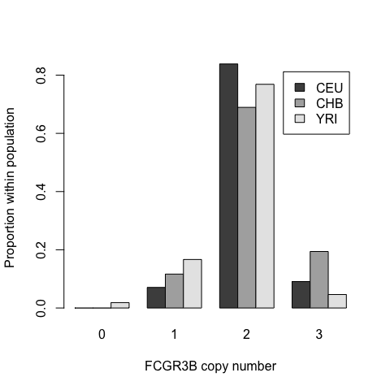
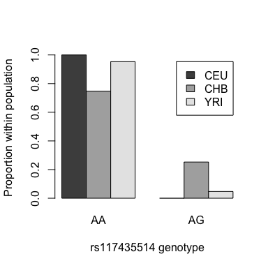

GENE315 CNV lab - week 2
================
Mik Black
5 & 6 April 2023

<!-- The following will produce markdown output that will be viewble on GitHub: -->
<!-- rmarkdown::render('GENE315-CNV_lab-week2.Rmd', output_format="github_document") -->
<!-- Use the following to create a file of R commands for the demonstrators (included in .gitignore): -->
<!-- knitr::purl('GENE315-CNV_lab-week2.Rmd') -->

## Overview

This week we will be doing three things:

- Continuing looking at the count data from last week, focusing on
  differences between the two loci (IRGM, FCGR) across the three
  populations (CEU, CHB, YRI).
- Looking at single nucleotide polymorphism (SNP) data from SNPs near
  the IRGM and FCGR3B genes.
- Combining the SNP and CNV data to investigate linkage disequilibrium
  (LD) in the three populations.

This document will walk through some simple analysis in R to accomplish
the tasks above. There is also a markdown version of this document
online which can be viewed in a browser (makes copying and pasting code
easier):

<https://github.com/mikblack/GENE315-CNVlab/blob/master/GENE315-CNV_lab-week2.md>

**REMINDER: FOR YOUR ASSIGNMENT YOU WILL NEED TO ALTER THE CODE BELOW TO
PERFORM A SIMILAR ANALYSIS FOR THE IRGM DATA AND THE RELEVANT SNP
(rs13361189).**

## CNV - back to FCGR

Load the FCGR count data that we used last week:

``` r
fcgrDat = read.csv('FCGR-counts.csv', row.names=1)
```

One of the tasks last week was to use the commands you had learned to
loop through the first 20 plots of the FCGR data for the CEU population.
Hopefully your code looked something like this (if not, this should give
you a pretty good hint of what your code *should* look like):

``` r
source('plotCNV.R')
par(ask=T)
for(i in 1:20){
  plotCNV( fcgrDat, colnames(fcgrDat)[i], "FCGR", truncate=TRUE)
  abline(h = median(fcgrDat[,i]), col='blue')
  abline(h = 1.5*median(fcgrDat[,i]), col='blue', lty=2)
  abline(h = 0.5*median(fcgrDat[,i]), col='blue', lty=2)
}
```

One of your tasks last week was to use this code to examine the FCGR
region for the first 20 samples in the CEU population.  
The goal was to identify samples that exhibit CNV (i.e., do not have
CN=2) for the FCGR3B gene (marked as “3B” on the plot).

This week we are looking at copy number is ALL the samples!

## Copy number calls

Luckily for you I went through all 310 samples and manually called
(i.e., guesstimated) copy number for the region upstream of IRGM, and
for the FCGR3B gene, based on the plots of the count data (yep, thats
right - 310 samples, twice…)

These data are saved in the file `CNcalls.csv`. You can load them into R
via:

``` r
CNcalls = read.csv('CNcalls.csv')
```

View the first rows of the data via:

``` r
head(CNcalls)
```

    ##    Sample Population IRGM_CN FCGR3B_CN
    ## 1 NA06984        CEU       2         2
    ## 2 NA06985        CEU       2         2
    ## 3 NA06986        CEU       1         2
    ## 4 NA06989        CEU       2         3
    ## 5 NA06994        CEU       2         2
    ## 6 NA07000        CEU       2         2

Have a look at the FCGR3B copy number calls for the first 20 samples -
do they agree with the calls you made when you generated the 20 FCGR
region plots above?

As for the count data, the first 99 rows relate to the CEU population,
the next 103 relate to CHB and the final 108 are for YRI. We can
investigate the relationship differences in FCGR3B copy number across
populations via:

``` r
fcgrTab = table(CNcalls[,"Population"], CNcalls[,"FCGR3B_CN"])
fcgrTab
```

    ##      
    ##        0  1  2  3
    ##   CEU  0  7 83  9
    ##   CHB  0 12 71 20
    ##   YRI  2 18 83  5

The Chi-squared test can be used to determine whether the distribution
of copy number is consistent across the three populations:

``` r
chisq.test( fcgrTab )
```

    ## Warning in chisq.test(fcgrTab): Chi-squared approximation may be
    ## incorrect

    ## 
    ##  Pearson's Chi-squared test
    ## 
    ## data:  fcgrTab
    ## X-squared = 20.186, df = 6, p-value = 0.002566

As mentioned last week, it is more appropriate to use Fisher’s Exact
Test when possible, as the Chi-squared test is an approximation. Here
the results are similar:

``` r
fisher.test( fcgrTab )
```

    ## 
    ##  Fisher's Exact Test for Count Data
    ## 
    ## data:  fcgrTab
    ## p-value = 0.002169
    ## alternative hypothesis: two.sided

The significant p-value indicates that copy nmber variation for FCGR3B
does not occur at the same frequency across the three populations.

It is easiest to see this by converting the table data to proportions.
Adding the “1” parameter ensures that the proporitions are specific to
each row (population):

``` r
options(digits=3)
prop.table( fcgrTab, 1)
```

    ##      
    ##            0      1      2      3
    ##   CEU 0.0000 0.0707 0.8384 0.0909
    ##   CHB 0.0000 0.1165 0.6893 0.1942
    ##   YRI 0.0185 0.1667 0.7685 0.0463

We can also represent this information graphically:

``` r
barplot( prop.table( fcgrTab, 1), beside=TRUE, legend=TRUE,
         xlab="FCGR3B copy number", ylab= "Proportion within population")
```

<!-- -->

## SNP data

The file `CNcalls.csv` contains copy number calls for SNPs near the IRGM
and FCGR3B genes. For IRGM the SNP ID is `rs13361189`, and for FCGR3B
the SNP ID is `rs117435514`. These data are stored in the files
`IRGM_rs13361189.csv` and `FCGR_rs117435514.csv`.

These data were obtained from the ensembl website. Have a look at the
1000 Geneomes Project data for SNP `rs117435514` by searching for it at

<http://www.ensembl.org/Homo_sapiens/>

and then clicking on the “population genetics” link. This provides data
on SNP frequency (and also per-sample genotype) across the populations.
The data from this website was used to create SNP genotype files for the
samples we are analysing in this lab.

The data for FCGR can be loaded as follows:

``` r
fcgrSNP = read.csv('FCGR_rs117435514.csv')
```

Look at the first six rows:

``` r
head(fcgrSNP)
```

    ##   X  Sample Population rs117435514
    ## 1 1 NA06984        CEU          AA
    ## 2 2 NA06985        CEU        <NA>
    ## 3 3 NA06986        CEU          AA
    ## 4 4 NA06989        CEU          AA
    ## 5 5 NA06994        CEU          AA
    ## 6 6 NA07000        CEU          AA

The distribution of SNP genotypes can be examined via:

``` r
table( fcgrSNP[,"rs117435514"] )
```

    ## 
    ##  AA  AG 
    ## 236  28

which shows that most individuals have the AA genotype, and relatively
few have the AG genotype (and none have the GG genotype). Also, note
that some of the samples have missing genotype data for this SNP,
denoted by `<NA>` in the output above.

These genotypes can also be viewed across population groups, which shows
that most of the genotypic variation in this SNP occurs in the CHB
population:

``` r
table( fcgrSNP[,"Population"], fcgrSNP[,"rs117435514"] )
```

    ##      
    ##       AA AG
    ##   CEU 84  0
    ##   CHB 71 24
    ##   YRI 81  4

The amount of missing data can be inferred from the table above, since
there should be 99, 103 and 108 genotype values for the CEU, CHB and YRI
populations respectively. Adding `useNA='always'` to the `table` command
shows the missing data:

``` r
table( fcgrSNP[,"Population"], fcgrSNP[,"rs117435514"] , useNA='always')
```

    ##       
    ##        AA AG <NA>
    ##   CEU  84  0   15
    ##   CHB  71 24    8
    ##   YRI  81  4   23
    ##   <NA>  0  0    0

We can also represent the genotype proportions as a bar graph:

``` r
fcgrSnpTab = table( fcgrSNP[,"Population"], fcgrSNP[,"rs117435514"] )
round( prop.table(fcgrSnpTab, 1), 3)
```

    ##      
    ##          AA    AG
    ##   CEU 1.000 0.000
    ##   CHB 0.747 0.253
    ##   YRI 0.953 0.047

``` r
barplot( prop.table(fcgrSnpTab, 1), beside=TRUE, legend=TRUE, xlab="rs117435514 genotype", ylab= "Proportion within population")
```

<!-- -->

## TagSNPs - combining SNP and CNV data

If a specific SNP genotype is a associated with a change in copy number
in a particular region, then that SNP can be said to *tag* that copy
number variant. That is, an individual with that SNP genotype is more
likely to also have altered copy number for that region.

We can investigate this at the FCGR locus by combining the copy number
calls for FCGR3B with the genotype data for SNP rs117435514 (note that
this works because I’ve made sure that all of the data are in the same
order in each file):

``` r
table( fcgrSNP[,"rs117435514"], CNcalls[,"FCGR3B_CN"], dnn=c("SNP","CopyNumber") )
```

    ##     CopyNumber
    ## SNP    0   1   2   3
    ##   AA   1  33 185  17
    ##   AG   0   0  14  14

The `dnn` parameter allows us to label the rows and columns of the
table. We can look at just the CHB population as follows:

``` r
table( fcgrSNP[,"rs117435514"], CNcalls[,"FCGR3B_CN"],  CNcalls[,"Population"] )[,,"CHB"] 
```

    ##     
    ##       0  1  2  3
    ##   AA  0 12 55  4
    ##   AG  0  0 10 14

Clearly individuals in the CHB population are more likely to have 3
copies of the FCGR3B gene if they have the AG genotype as compared to
the AA genotype, but the *tagging* is not anywhere near perfect.

We can test to see if this association is statistically significant
using Fisher’s Exact Test:

``` r
fcgrCHBtab = table( fcgrSNP[,"rs117435514"], CNcalls[,"FCGR3B_CN"],  CNcalls[,"Population"] )[,,"CHB"] 
fisher.test( fcgrCHBtab )
```

    ## 
    ##  Fisher's Exact Test for Count Data
    ## 
    ## data:  fcgrCHBtab
    ## p-value = 2e-07
    ## alternative hypothesis: two.sided

So, even though the SNP rs117435514 does not tag CNV at FCGR3B
particularly well, the association is highly statistically significant
(i.e., it is very unlikely that we would see a relationship this strong
by chance).

## Assignment

The assignment for this module is due at 5pm on 26 April (Wednesday
stream) or 27 April (Thursday stream). For your document, please provide
answers to the questions below, and also the questions at the end of the
week 2 and week 3 handouts. When answering each question, please provide
the R code used to generate the output (if required), the output itself,
and any comments/discussion needed to fully answer the question. Please
keep the code, output and comments together for each question (similar
to how the lab handouts are laid out).

### Week two questions:

Please include the following details in your document:

1.  Load the IRGM copy number calls, and generate a table, a proportion
    table, and a barplot for these calls across the three populations.
    Comment on whether IRGM copy number status appears to be independent
    of population.

2.  Formally test for an association between population and copy number
    in the region upstream of IRGM. Comment on the test result, and
    provide an interpretation of this in terms of IRGM copy number
    frequencies in these populations.

3.  Load the rs13361189 SNP data, and generate a table showing the
    genotype frequencies. What is the most frequently observed
    geneotype?

4.  Look at the frequency of rs13361189 across the three populations -
    generate a table, a proportion table, and a barplot for these calls
    across the three populations. Formally test for an association
    between population and rs13361189 SNP genotype. Comment on your
    results, and provide an interpretation in terms of rs13361189
    genotype frequencies in these populations.

5.  Combine the rs13361189 SNP genotypes and copy number data relating
    to IRGM. Create a table of genotype versus copy number, and peform a
    formal test for association. Provide an interpretation of your
    results. How good is rs13361189 genotype at tagging loss of the
    region upstream of IRGM?

6.  How do your results (in terms of association between rs13361189
    genotype and IRGM copy number) compare to those presented by
    Prescott et al. (2010).

Prescott, N. J., Dominy, K. M., Kubo, M., Lewis, C. M., Fisher, S. A.,
Redon, R., et al. (2010). Independent and population-specific
association of risk variants at the IRGM locus with Crohn’s disease.
*Human Molecular Genetics*, 19(9), 1828–1839.
<http://doi.org/10.1093/hmg/ddq041>
