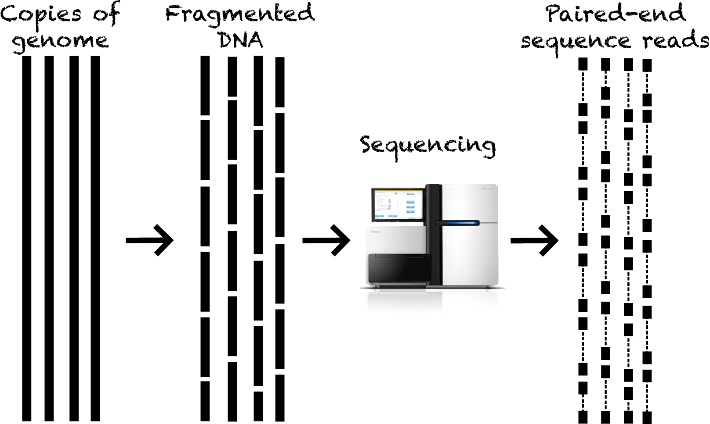
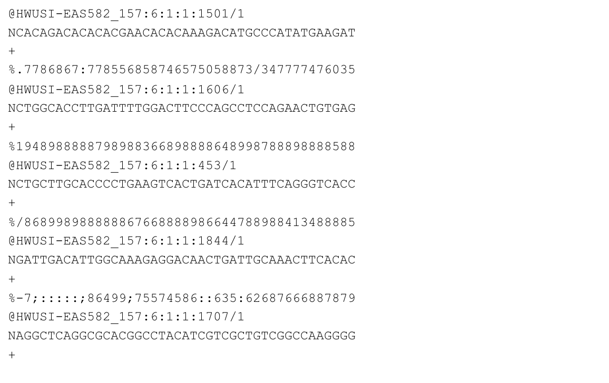
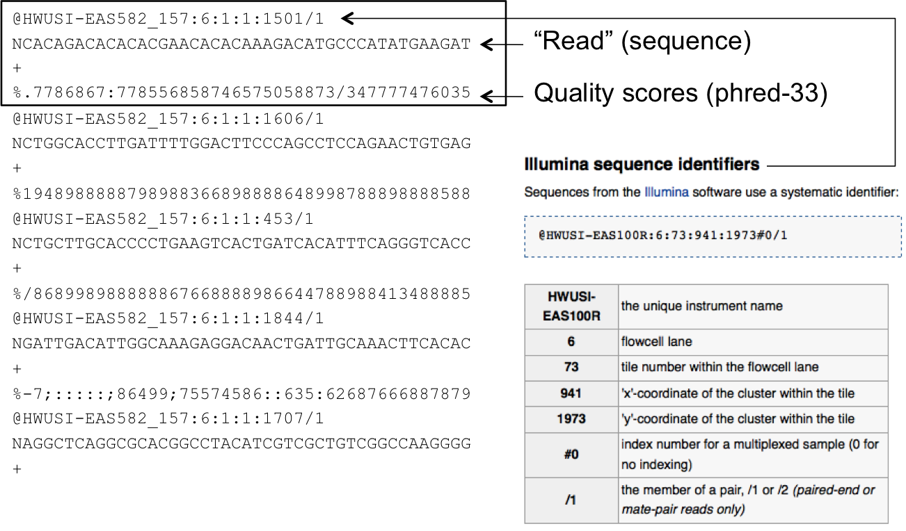
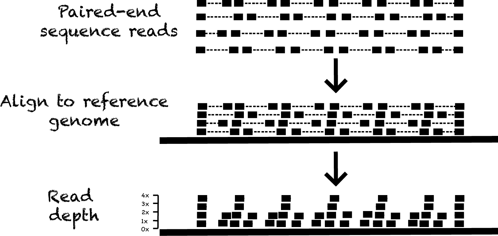
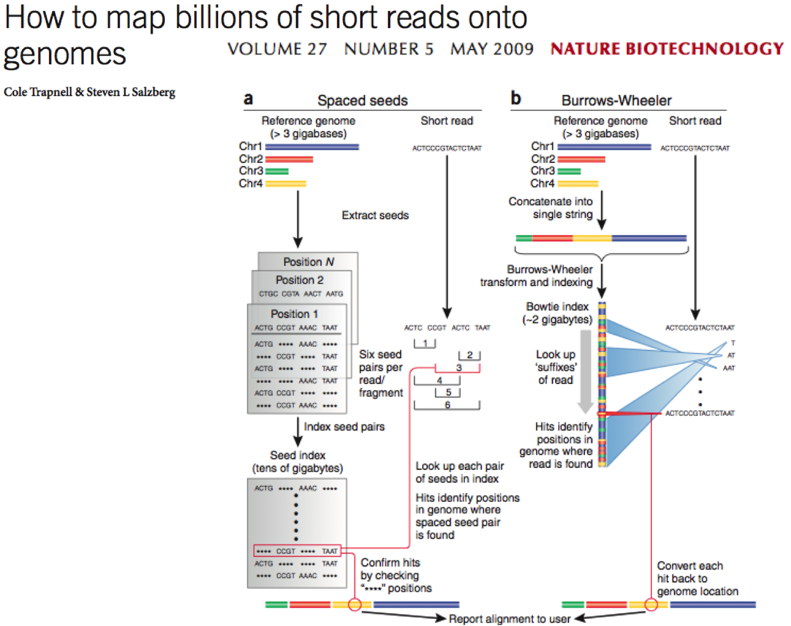
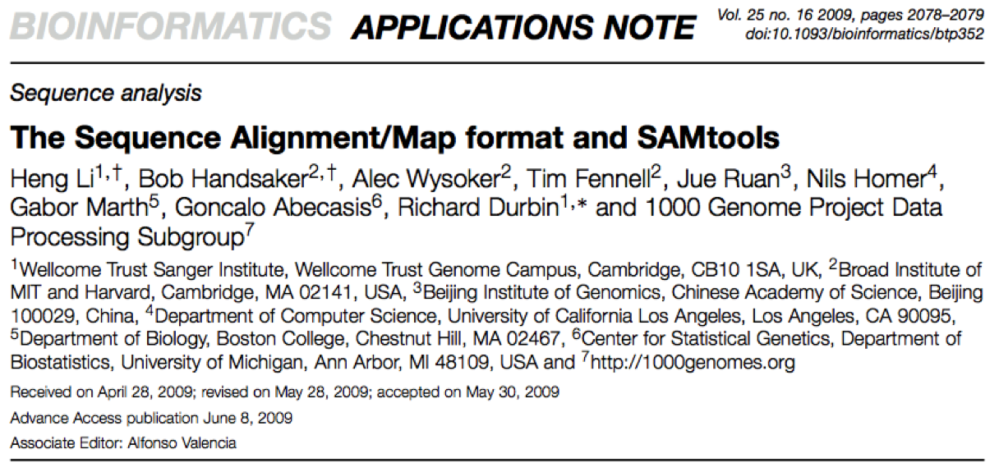
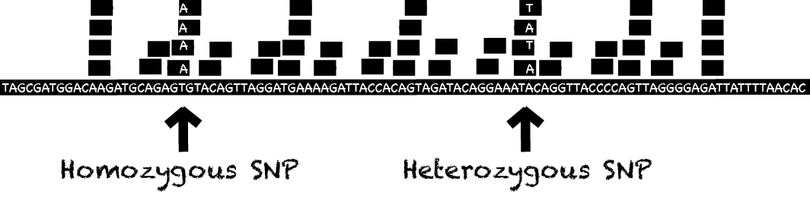

## Sequencing data

 - Next (Second) Generation Sequencing has revolutionized how we study genetic variation.
 - It is now routine to generate a whole-genome characterisation of SNPs (single nucleotide polymorphisms), InDels (Insertions/Deletions) and 
 SVs (structural variants, e.g., copy number variation) for an individual. 

---

## Recap - generating NGS data

---

## Data format: FASTQ

 - The read data generated by the sequencer are stored in the *FASTQ* format.
 - FASTQ allows the storage of both sequence and quality information for each read.
 - This is a compact text-based format that has become the de facto standard for storing data from next generation sequencing experiments.

---

## Fastq format

### http://en.wikipedia.org/wiki/FASTQ_format

---

## Fastq format

### http://en.wikipedia.org/wiki/FASTQ_format

--- 

## Identifying variation

 - In situations where a reference genome is available (i.e., organisms for
 which the genome has previously been sequenced and assembled), the sequencing of additional members of the species is often refered to as *resequencing*.
 - In order to identify variation in the resequenced samples, the sequence data is compared to the existing reference genome to allow differences to be identified.
 - This involves finding the place in the reference genome that each read matches to.
 - Due to high sequence similarity within members of the same species, most reads should map to the reference.

---

## Mapping reads to the reference genome

---

## Tools for generating alignments

 - There are MANY software packages available for aligning data from next generation sequencing experiments.
 - Two of the most popular are:
   - BWA:  http://bio-bwa.sourceforge.net
   - Bowtie:  http://bowtie-bio.sourceforge.net
 - Both utilize the “Burrows-Wheeler Transform.”

---

### Trapnell, C., & Salzberg, S. L. (2009). How to map billions of short reads onto genomes. Nature Biotechnology, 27(5), 455–457.

---

## Alignment formats

 - SAM (Sequence Alignment/Map) format has become the _de facto_ standard for storing alignment data.
 - BAM is a binary version of SAM allowing more efficient storage.

### Li, H., Handsaker, B., Wysoker, A., Fennell, T., Ruan, J., Homer, N., et al. (2009). The Sequence Alignment/Map format and SAMtools. Bioinformatics (Oxford, England), 25(16), 2078–2079.

---

## Aligned data - finding SNPs

 - Alignment to the reference genome allows identification of single base 
 differences (i.e., SNPs) in a new sample.
 - There are **MANY** software tools that can perform SNP detection.
 - A reasonable level of coverage is required for accurate detection, particularly for 
 heterozygotes.

---

## Using read depth to find copy number changes

 - Sequence data can also be used to identify changes in copy number for specific regions of DNA.
 - Various methods exist, but a relatively simple approach involves identifying changes in read depth that are consistent with an increase or decrease in DNA copy number.

---

## Detecting DNA duplication

---

## Detecting DNA deletion

---

## Quantifying read depth across region

 - Break the region of interest into evenly sized windows, and count the number of reads
 that start in each window.
 - Use a statistical algorithm to identify "change points" - places where the average 
 number of reads per window changes (up or down), over a substantial distance.

